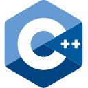
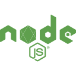

# Hello world! I am Mr Klava - aka JabbaScripter

## Few words About Me

&nbsp;

&nbsp;

&nbsp;

&nbsp;

:anchor: Ex professional seafarer in the Oil & Gas industry
 :computer: Started to learn coding in the middle of 2020 as a hobby on vacation
 :floppy_disk: Working as Fulstack Web Developer in international company
 :book: Constantly learning new things - CS Deegree student
 :running: Amature runner who ran a couple of marathons
 :mount_fuji: In Free time trying to keep an active lifestyle with traveling

## Education

[X] [Fabrique Numérique](https://fabriquenumerique.fr/) - Web Application Developer and Integrato - <b>EQF Level 5</b>
 [ ] [Fabrique Numérique](https://fabriquenumerique.fr/) - Application Developer - <b>EQF Level 6</b>
 [ ] [Transport and Telecommunication Institute (TSI)](https://tsi.lv/) - Computer Science - <b>BNSc</b>

## Passed courses

[x] [JetBrains Academy](https://www.jetbrains.com/academy/) - ["Track: Frontend Developer"](https://hyperskill.org/profile/192486091)
 [x] [freeCodeCamp.org](https://www.freecodecamp.org/learn) - ["JavaScript Algorithms and Data Structures"](https://www.freecodecamp.org/certification/mrKlava/javascript-algorithms-and-data-structures)
 [x] [HarvardX](https://www.edx.org/school/harvardx) - ["CS50's Introduction to Computer Science"](https://pll.harvard.edu/course/cs50-introduction-computer-science)
 [ ] [HarvardX](https://www.edx.org/school/harvardx) - ["CS50’s Introduction to Artificial Intelligence with Python"](https://pll.harvard.edu/course/cs50s-introduction-artificial-intelligence-python)

### Solving programming problems from time to time 

 

## Languages & Tools I have used 

<table>
<tbody>
<tr>
<td></td>
<td></td>
<td>
</td>
<td>
</td>
<td></td>
</tr>
<tr>
<td></td>
<td>
</td>
<td>
</td>
</tr>
<tr>
<td></td>
<td></td>
<td></td>
</tr>
<tr>
<td>
</td>
<td></td>
<td></td>
</tr>
<tr>
<td>
</td>
<td></td>
<td></td>
<td>
</td>
<td>
</td>
</tr>
<tr>
<td>
</td>
<td></td>
<td></td>
<td>
</td>
</tr>
<tr>
<td>
</td>
<td></td>
<td></td>
</tr>

<tr>
<td></td>
<td></td>
<td></td>
<td></td>
<td>
</td>
</tr>
</tbody>
</table>

</td>
